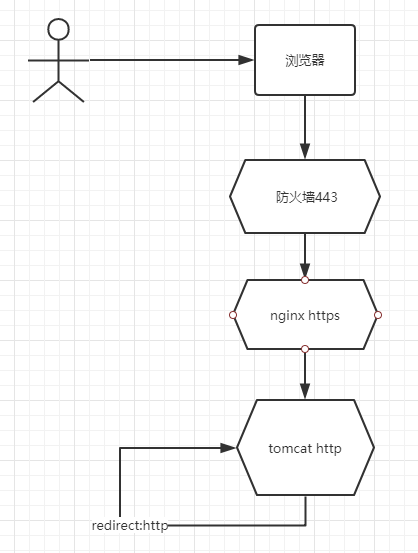
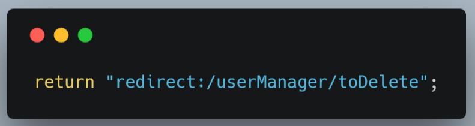
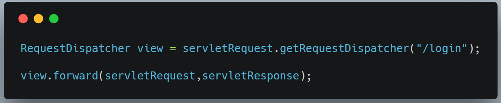
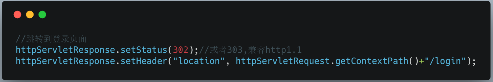
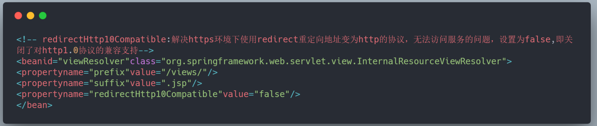

# nginx https tomcat redirect 成 http 引发400错误

**一、https 被redirect成了http**

背景：

目前一号双终端项目并不是全站的https，而是仅在防火墙上配置了https,其架构大致下面这样：

也就是说https加密，仅限于浏览器到nginx之间，而对web应用来说，所有的请求都是http的，这样如果应用中使用sendRedirect的请求，将会被转发到http。比如该项目中，原先的写法：

解决方案：

1. 跳转URL时使用绝对地址https（该方法不建议）

就是在filter中跳转地址前强制加上https，这种方法不够灵活，不建议使用

2. 使用forward方法

在servlet中使用RequestDispatcher的forward方法，它与sendRedirect的主要区别在于forward相当于一次请求，然后服务器端内部，以方法调用的方式转到目标地址。写法如下：

// 跳转到登录页面         

不过使用forward(请求转发)方法，地址栏中看到的只有一个地址，比如 https://yihaoduozhongduan.com:8088/yhdzd/ ，服务器返回了login.jsp页面，但浏览器地址栏没有改变。

3. 在响应信息中设置HTTP状态码和location头信息

进行URL重定向时，服务器设置HTTP状态码和location头信息，当状态码为302时，表明资源位置临时发生了改变，需要进行重定向，location头信息标识了资源转向的位置，该地址写相对地址。写法如下：

4. spring mvc中，可以直接配置，将redirectHttp10Compatible属性设为false。如下：

事实上，翻一翻spring底层的源码，可以看到，当redirectHttp10Compatible设为false的时候，处理方法也和上面3中提到的方法一致。设置了response头中的location和状态码。

1. 还有可以在Apache设置https反向代理，解决该问题。不过这不是应用层面的东西，这里不深究了

参考链接：

http://www.javatang.com/archives/2018/01/10/22132246.html#NginxX-Forwarded-Protohttp://rensanning.iteye.com/blog/2337766https://blog.csdn.net/YangFanJ/article/details/72236655

https://blog.csdn.net/zhuye1992/article/details/80496151
