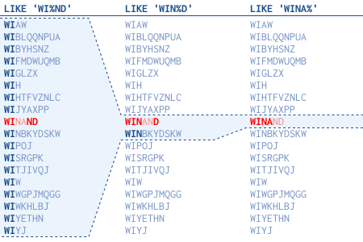

# Algorithm

## 题目

### 题目大意：国际摩尔斯电码规定了一种标准编码，其中每个字母都映射到一系列点和短划线，为方便起见，下面给出了英文字母26个字母的完整表格。现在，给定一个单词列表，每个单词可以写成每个字母的摩尔斯代码的串联。

International Morse Code defines a standard encoding where each letter is mapped to a series of dots and dashes, as follows: "a" maps to ".-", "b" maps to "-...", "c" maps to "-.-.", and so on.

For convenience, the full table for the 26 letters of the English alphabet is given below:

[".-","-...","-.-.","-..",".","..-.","--.","....","..",".---","-.-",".-..","--","-.","---",".--.","--.-",".-.","...","-","..-","...-",".--","-..-","-.--","--.."]
Now, given a list of words, each word can be written as a concatenation of the Morse code of each letter. For example, "cba" can be written as "-.-.-....-", (which is the concatenation "-.-." + "-..." + ".-"). We'll call such a concatenation, the transformation of a word.

Return the number of different transformations among all words we have.

Example:
Input: words = ["gin", "zen", "gig", "msg"]
Output: 2
Explanation:
The transformation of each word is:
"gin" -> "--...-."
"zen" -> "--...-."
"gig" -> "--...--."
"msg" -> "--...--."

There are 2 different transformations, "--...-." and "--...--.".

### 第一种解法：将单词与对应摩斯码放入HashMap中迭代传入的word再将值放入hashSet中，利用其去重特性，最后得到hashSet的size，及重复摩斯码的个数

```java
public int uniqueMorseRepresentations(String[] words) {
    HashMap<Character,String> dict = new HashMap();
    HashSet hashSet = new HashSet();
    dict.put('a', ".-");
    dict.put('b', "-...");
    dict.put('c', "-.-.");
    dict.put('d', "-..");
    dict.put('e', ".");
    dict.put('f', "..-.");
    dict.put('g', "--.");
    dict.put('h', "....");
    dict.put('i', "..");
    dict.put('j', ".---");
    dict.put('k', "-.-");
    dict.put('l', ".-..");
    dict.put('m', "--");
    dict.put('n', "-.");
    dict.put('o', "---");
    dict.put('p', ".--.");
    dict.put('q', "--.-");
    dict.put('r', ".-.");
    dict.put('s', "...");
    dict.put('t', "-");
    dict.put('u', "..-");
    dict.put('v', "...-");
    dict.put('w', ".--");
    dict.put('x', "-..-");
    dict.put('y', "-.--");
    dict.put('z', "--..");
    for(int j=0; j<words.length ; j++ ) {
        StringBuilder sb = new StringBuilder();
        for (int i = 0; i < words[j].length();i++){
            sb.append(dict.get(words[j].charAt(i)));
        }
        hashSet.add(sb.toString());
    }
    return hashSet.size();
}
```

### 第二种解法：先将码表初始化成String数组(已排好顺序a,b,...,z)，同理也用到HashSet，计算字母c-char('a')得到每个字母的类hash值拼接成的一个串，取hashSet.size

```java
public int uniqueMorseRepresentations(String[] words) {
  String[] d = {".-", "-...", "-.-.", "-..", ".", "..-.", "--.", "....", "..", ".---", "-.-", ".-..", "--", "-.", "---", ".--.", "--.-", ".-.", "...", "-", "..-", "...-", ".--", "-..-", "-.--", "--.."};
  HashSet<String> s = new HashSet<>();
  for (String word : words) {
      StringBuilder sb = new StringBuilder();
      for (char c : word.toCharArray()) sb.append(d[c - 'a']);
      s.add(sb.toString());
  }
  return s.size();
}
```

# Review

## 来自亚马逊总裁**Jeff Bezos**的一些建议


_几年前，Jeff Bezos在我们的办公室停下来，花了大约90分钟与我们谈论产品策略。在他离开之前，他花了大约45分钟从办公室里的每个人那里接受问答。_

_在他的一个答案中，他分享了一个关于“正确的人”的开明观察。_

_他说，经常改变主意的人很多时候都是对的。他并不认为思想的一致性是一个特别积极的现象。它是完全正确的，甚至鼓励 -，明天有一个想法与你今天的想法相矛盾。_

_他观察到最聪明的人不断修改他们的理解，重新考虑他们认为已经解决的问题。他们对自己的思维方式开辟了新的观点，新的信息，新的想法，矛盾和挑战。_

_这并不意味着你不应该有一个良好的观点，但这意味着你应该把你的观点视为暂时的。_

_什么特质表明了很多时候出错的人？有人痴迷于只支持一种观点的细节。如果有人无法从细节中爬出来，并从多个角度看大局，那么大多数时候他们往往都是错的。_

## Some advice from Jeff Bezos
A number of years ago, Jeff Bezos stopped by our office and spent about 90 minutes with us talking product strategy. Before he left, he spent about 45 minutes taking general Q&A from everyone at the office.

During one of his answers, he shared an enlightened observation about people who are “right a lot”.

He said people who were right a lot of the time were people who often changed their minds. He doesn’t think consistency of thought is a particularly positive trait. It’s perfectly healthy — encouraged, even — to have an idea tomorrow that contradicted your idea today.

He’s observed that the smartest people are constantly revising their understanding, reconsidering a problem they thought they’d already solved. They’re open to new points of view, new information, new ideas, contradictions, and challenges to their own way of thinking.

This doesn’t mean you shouldn’t have a well formed point of view, but it means you should consider your point of view as temporary.

What trait signified someone who was wrong a lot of the time? Someone obsessed with details that only support one point of view. If someone can’t climb out of the details, and see the bigger picture from multiple angles, they’re often wrong most of the time.

Great advice.

# Technique/Tips

    业务需求需要对资源池号码尾号进行匹配，出现like不走索引,表顺扫的情况，如like = '%8888'，，没有走索引。如下图，



后续解决方案暂时能考虑到的是对每条数据增加一个标签标识字段，如label = '8888'，对label进行索引。

参考：[like-performance-tuning](https://use-the-index-luke.com/sql/where-clause/searching-for-ranges/like-performance-tuning)

# Share

美国最著名的物理学家、诺贝尔奖得主费曼，小时候与一个号称无所不知的孩子，一起出去玩。他后来回忆了两个人的一段对话。

> 他对我说："看那只鸟？ 那是什么鸟？" 
> 
> 我说："我一点也不知道它是一只什么样的鸟。" 
> 
> 他说："这是一只棕色喉咙画眉。 你父亲没教你吗？" 
> 
> 事实恰恰相反。 他[费曼的父亲]已经教过我："看那只鸟？"他说。 "这是斯宾塞的鸣鸟。"（我知道他不知道真名。）"好吧，在意大利语中，这是一个Chutto Lapittida 。 在葡萄牙语中，它是一个Bom da Peida ...你可以在世界上所有语言中知道那只鸟的名字，但是当你说完后，你对这只鸟一无所知！ 你只会知道不同地方的人类怎么叫这只鸟。 所以，让我们看一下这只鸟，看看它在做什么 - 这就是最重要的。"
> 
> 所以，我很早就知道了，知道某事物的名字和知道它是什么之间的区别。
