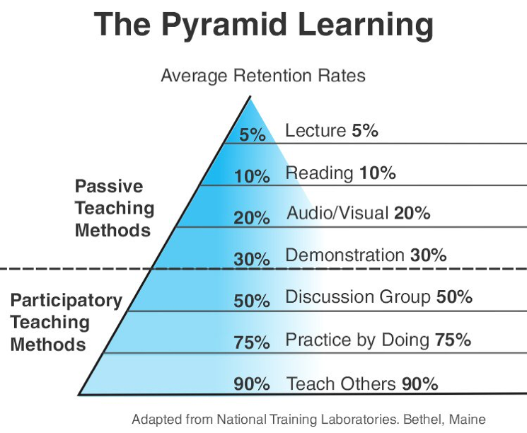

# 端正学习态度

> 以下文章思想来自于极客时间-左耳朵耗子，是阅读该系列文章后的一些感悟。我觉得这很有用，在我之前一系列的迷茫生活过后，仿佛点亮了一盏明灯。
>
> 人啊，就像被一层层玻璃杯罩住的苍蝇，虽然你可以随意看到外面缤纷多彩的世界，但是你的眼界也只在这个玻璃杯里面，只能毫无头绪的乱撞。或许，只有哪天你钻出了这个玻璃杯，你的眼界也就真正的提升了。

## 学习态度

学习是不可能速成的，一辈子学习可能让你当前生活地更累，但是或许以后会更轻松呢？Who konw?

学习是一件逆人性的事情，需要你持续的付出，而且这种付出短期还能难见成效，会让你迷茫，不知道坚持下去是否有结果。

有时候我会更希望自己没有那所谓的小聪明，不得不承认，我们大多数人都觉得自己是聪明的，就拿我上学时期举例，可能别人一直在学习的东西，你可能随便一学就会了，你会觉得别人一直学习完全是一种很笨的表现。我很后悔我有这种想法，而且还保持了很长一段时间。它让我不能深入一件事情。让我不能体会坚持，在遇到无数挫折之后成功的那种感受。所以起初当我尝试计划长时间学习的时候，这种感觉让我永远都是三分钟热度。

大多数人都觉得自己是爱学习的：
- 他们都是只有意识没有行动，他们是动力不足的人。
- 他们都不知道自己该学什么，他们缺乏方向和目标。
- 他们都不具备自主学习的能力，没有正确的方法和技能。
- 更要命的是，他们缺乏实践和坚持。

所以，**端正学习态度**比好到各种学习资料更为重要，如果你不能克服自己DNA中的弱点，不能端正自己的态度，不能自律，不能坚持，不能举一反三，不能不断追问等。那么，无论多好的方法，你都不可能学习好。

## 主动学习和被动学习

下面来说一些学习的方法，但是记住**学习态度**很重要！

下图是美国学者埃德加·戴尔提出的[学习金字塔]（Cone of learning）

人的学习分为「被动学习」和「主动学习」两个层次。
 
- 被动学习：如听讲、阅读、视听、演示，学习内容的平均留存率为 5%、10%、20% 和 30%。
 
- 主动学习：如通过讨论、实践、教授给他人，会将原来被动学习的内容留存率从 5% 提升到 50%、75% 和 90%。

这个模型很好地展示了不同学习深度和层次之间的对比。

我们可以看到，你听别人讲，或是自己看书，或是让别人演示给你，这些都不能让你真正获得学习能力，因为你是在被别人灌输，在听别人说。

只有你开始自己思考，开始自己总结和归纳，开始找人交流讨论，开始践行，并开始对外输出，你才会掌握到真正的学习能力。

学习不是努力读更多的书，盲目追求阅读的速度和数量，这会让人产生低层次的勤奋和成长的感觉，这只是在使蛮力。要思辨，要践行，要总结和归纳，否则，你只是在机械地重复某件事，而不会有质的成长的。

## 浅度学习和深度学习

当前这个社会：

- 大多数人的信息渠道都被微信朋友圈、微博、知乎、今日头条、抖音占据着。这些信息渠道中有营养的信息少之又少。

- 大多数公司都是实行类似于 996 这样的加班文化，在透支和消耗着下一代年轻人，让他们成长不起来。

- 因为国内互联网访问不通畅，加上英文水平受限，所以，大多数人根本没法获取到国外的第一手信息。

- 快餐文化盛行，绝大多数人都急于速成，心态比较浮燥，对事物不求甚解。

我们现在的社会已经进入了信息大爆炸时代，我们不需要担心没知识科学，相反有源源不断各种各样的知识。而且我们的时间都被打成了碎片，很少有大段的时间能让你静下心来学习。不知不觉你也成为了快餐文化的拥趸。

在这样一个时代，种种迹象表明，快速、简单、轻松的方式给人带来的快感更强烈。而高层次的思考、思辨和逻辑则被这些频度高的快餐信息感所弱化。各种代读、领读和听读类产品，让人们可以在短时间内体会到轻松获取知识的快感，并产生勤奋好学和成长的幻觉。

曾经我总喜欢在类似于掘金、公众号之类的搜索各种精品文章，刚开始我总觉得就像搜集了各种武功秘籍，就成为了高手。久而久之我发现这类文章对我并没有任何帮助。他们遇到的经典问题，我没有出现过相应的场景，没有共鸣也就导致理解甚微。其次大量翻译的文章，没有表达出原作者的用意。长时间对我造成了负面反馈，反而降低了我学习的热情。

你有没有发现，在知识的领域也有阶层之分，那些长期在底层知识阶层的人，需要等着高层的人来喂养，他们长期陷于各种谣言和不准确的信息环境中，于是就导致错误或幼稚的认知，并习惯于那些不费劲儿的轻度学习方式，从而一点点地丧失了深度学习的独立思考能力，从而再也没有能力打破知识阶层的限制，被困在认知底层翻不了身。

可见深度学习十分重要，但应该怎样进行深度学习呢？下面几点是关键。
 
- 高质量的信息源和第一手的知识。
- 把知识连成地图，将自己的理解反述出来。
- 不断地反思和思辨，与不同年龄段的人讨论。
- 举一反三，并践行之，把知识转换成技能。

换言之，学习有三个步骤。

- 知识采集。信息源是非常重要的，获取信息源头、破解表面信息的内在本质、多方数据印证，是这个步骤的关键。

- 知识缝合。所谓缝合就是把信息组织起来，成为结构体的知识。这里，连接记忆，逻辑推理，知识梳理是很重要的三部分。

- 技能转换。通过举一反三、实践和练习，以及传授教导，把知识转化成自己的技能。这种技能可以让你进入更高的阶层。

## 学习是为了找到方法

学习不仅仅是为了找到答案，而更是为了找到方法。很多时候，尤其是中国的学生，他们在整个学生时代都喜欢死记硬背，因为他们只有一个 KPI，那就是在考试中取得好成绩，所以，死记硬背或题海战术成了他们的学习习惯。然而，在知识的海洋中，答案太多了，你是记不住那么多答案的。

只有掌握解题的思路和方法，你才算得上拥有解决问题的能力。所有的练习，所有的答案，其实都是在引导你去寻找一种“以不变应万变”的方法或能力。在这种能力下，你不需要知道答案，因为你可以用这种方法很快找到答案，找到解，甚至可以通过这样的方式找到最优解或最优雅的答案。

这就好像，你要去登一座山，一种方法是通过别人修好的路爬上去，一种是通过自己的技能找到路（或是自己修一条路）爬上去。也就是说，需要有路才爬得上山的人，和没有路能造路的人相比，后者的能力就会比前者大得多得多。所以，学习是为了找到通往答案的路径和方法，是为了拥有无师自通的能力。

## 学习是为了找到原理

学习不仅仅是为了知道，而更是为了思考和理解。在学习的过程中，我们不是为了知道某个事的表面是什么，而是要通过表象去探索其内在的本质和原理。真正的学习，从来都不是很轻松的，而是那种你知道得越多，你的问题就会越多，你的问题越多，你就会思考得越多，你思考得越多，你就会越觉得自己知道得少，于是你就会想要了解更多。如此循环，是这么一种螺旋上升上下求索的状态。

但是，这种循环，会在你理解了某个关键知识点后一下子把所有的知识全部融会贯通，让你赫然开朗，此时的那种感觉是非常美妙而难以言语的。在学习的过程中，我们要不断地问自己，这个技术出现的初衷是什么？是要解决什么样的问题？为什么那个问题要用这种方法解？为什么不能用别的方法解？为什么不能简单一些？……

这些问题都会驱使你像一个侦探一样去探索背后的事实和真相，并在不断的思考中一点一点地理解整个事情的内在本质、逻辑和原理。一旦理解和掌握了这些本质的东西，你就会发现，整个复杂多变的世界在变得越来越简单。你就好像找到了所有问题的最终答案似的，一通百通了。

## 学习是为了了解自己

学习不仅仅是为了开拓眼界，而更是为了找到自己的未知，为了了解自己。英文中有句话叫：You do not know what you do not know，可以翻译为：你不知道你不知道的东西。也就是说，你永远不会去学习你不知道其存在的东西。就好像你永远 Google 不出来你不知道的事，因为对于你不知道的事，你不知道用什么样的关键词，你不知道关键词，你就找不到你想要的知识。

这个世界上有很多东西是你不知道的，所以，学习可以让你知道自己不知道的东西。只有当我们知道有自己不知道的东西，我们才会知道我们要学什么。所以，我们要多走出去，与不同的人交流，与比自己聪明的人共事，你才会知道自己的短板和缺失，才会反过来审视和分析自己，从而明白如何提升自己。

山外有山，楼外有楼，人活着最怕的就是坐井观天，自以为是。因为这样一来，你的大脑会封闭起来，你会开始不接受新的东西，你的发展也就到了天花板。开拓眼界的目的就是发现自己的不足和上升空间，从而才能让自己成长。

## 学习是为了改变自己

学习不仅仅是为了成长，而更是为了改变自己。很多时候，我们觉得学习是为了自己的成长，但是其实，学习是为了改变自己，然后才能获得成长。为什么这么说呢？我们知道，人都是有直觉的，但如果人的直觉真的靠谱，那么我们就不需要学习了。而学习就是为了告诉我们，我们的很多直觉或是思维方式是不对的，不好的，不科学的。

只有做出了改变后，我们才能够获得更好的成长。你可以回顾一下自己的成长经历，哪一次你有质的成长时，不是因为你突然间开窍了，开始用一种更有效率、更科学、更系统的方式做事，然后让你达到了更高的地方。不是吗？当你学习了乘法以后，在很多场景下，就不需要用加法来统计了，你可以使用乘法来数数，效率提升百倍。

当你有一天知道了逻辑中的充要条件或是因果关系后，你会发现使用这样的方式来思考问题时，你比以往更接近问题的真相。学习是为了改变自己的思考方式，改变自己的思维方式，改变自己与生俱来的那些垃圾和低效的算法。总之，学习让我们改变自己，行动和践行，反思和改善，从而获得成长。

## 小结

总结一下今天的内容。首先，学习是一件“逆人性”的事，就像锻炼身体一样，需要人持续付出，但会让人痛苦，并随时可能找理由放弃。如果你不能克服自己 DNA 中的弱点，不能端正自己的态度，不能自律，不能坚持，不能举一反三，不能不断追问等，那么，无论有多好的方法，你都不可能学好。因此，有正确的态度很重要。

此外，还要拥有正确的学习观念：学习不仅仅是为了找到答案，而更是为了找到方法；学习不仅仅是为了知道，而更是为了思考和理解；学习不仅仅是为了开拓眼界，而更是为了找到自己的未知，为了了解自己；学习不仅仅是为了成长，而更是为了改变自己，改变自己的思考方式，改变自己的思维方式，改变自己与生俱来的那些垃圾和低效的算法。

端正的学习态度和正确的学习观念，是高效学习的第一步，拥有这两者一定可以让你事半功倍。然后就是要总结和掌握高效学习的方法。