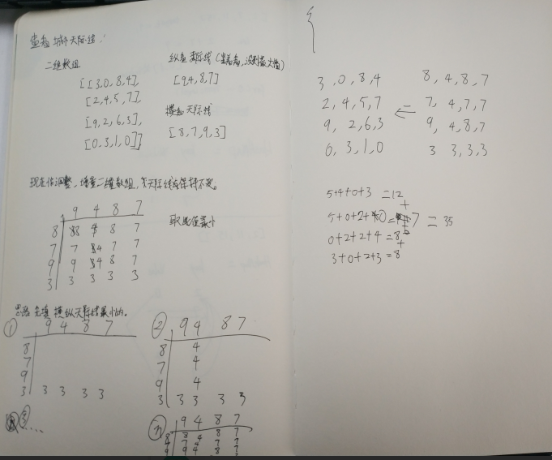

# Algorithm

## 题目

### 题目大意

在二维数组grid中，grid[i][j]代表位于某处的建筑物的高度。 我们被允许增加任何数量（不同建筑物的数量可能不同）的建筑物的高度。 高度 0 也被认为是建筑物。

最后，从新数组的所有四个方向（即顶部，底部，左侧和右侧）观看的“天际线”必须与原始数组的天际线相同。 城市的天际线是从远处观看时，由所有建筑物形成的矩形的外部轮廓。 请看下面的例子。

建筑物高度可以增加的最大总和是多少？

例子：
输入： grid = [[3,0,8,4],[2,4,5,7],[9,2,6,3],[0,3,1,0]]
输出： 35
解释：
The grid is:
[ [3, 0, 8, 4],
  [2, 4, 5, 7],
  [9, 2, 6, 3],
  [0, 3, 1, 0] ]

从数组竖直方向（即顶部，底部）看“天际线”是：[9, 4, 8, 7]
从水平水平方向（即左侧，右侧）看“天际线”是：[8, 7, 9, 3]

在不影响天际线的情况下对建筑物进行增高后，新数组如下：

gridNew = [ [8, 4, 8, 7],
            [7, 4, 7, 7],
            [9, 4, 8, 7],
            [3, 3, 3, 3] ]

### 思路



主要比较横纵天际线交叉点的最小值，再减去初始值。累计成最终增量。

```java
public int maxIncreaseKeepingSkyline(int[][] grid) {
  
  int N = grid.length;
  int[] rowMaxes = new int[N];
  int[] colMaxes = new int[N];
  //获取横纵天际线
  for (int r = 0; r < N; ++r)
      for (int c = 0; c < N; ++c) {
          rowMaxes[r] = Math.max(rowMaxes[r], grid[r][c]);
          colMaxes[c] = Math.max(colMaxes[c], grid[r][c]);
  }

  int ans = 0;
  for (int r = 0; r < N; ++r)
      for (int c = 0; c < N; ++c)
          ans += Math.min(rowMaxes[r], colMaxes[c]) - grid[r][c];

  return ans;
}
```

# Review

## [The Log: What every software engineer should know about real-time data's unifying abstraction](https://engineering.linkedin.com/distributed-systems/log-what-every-software-engineer-should-know-about-real-time-datas-unifying) [中译版](https://github.com/oldratlee/translations/tree/master/log-what-every-software-engineer-should-know-about-real-time-datas-unifying)

>每个程序员都熟悉另一种日志记录的定义 —— 应用使用syslog或者log4j写入到本地文件里的无结构的错误信息或者追踪信息。为了区分，这种情形的称为『应用日志记录』。 应用日志记录是我说的日志概念的一种退化。两者最大的区别是：文本日志意味着主要用来方便人去阅读，而构建我所说的『日志（journal）』或者『数据日志（data logs）』是用于程序的访问。

日志：每个软件工程师都应该知道的有关实时数据的统一抽象。
日志就和堆栈一样，简单的不能在简单，但实用的不能再实用。
本文作者Jay Kreps是前Linkedin的Principal Staff Engineer，现任Confluent公司的联合创始人和CEO，Kafka和Samza的主要作者。

# Technique/Tips

## gitlab搭建

gitlab环境搭建是比较头疼的，我是打算在公司内部搭建一个gitlab，用于日后的项目部署。参考官网的方法使用yum源(公司的系统是ReaHat6.7)下载，众所周知国内的网络有点问题，导致下载源失败。

后来问了一下友人，参考他的[centos7安装部署gitlab服务器教程](https://www.iyusen.com/install-gitlab/)，这次使用清华大学的镜像源，直接下载rpm包,进行安装。成功配置并启动gitlab。

## docker环境搭建

有了搭建gitlab的教训，这次docker的搭建我使用了VPS，在[vultr](https://www.vultr.com/)上申请了一台服务器，当然在申请的就是就可以选择搭建docker。我选择手动搭建。

参考[docker教程](https://docker-curriculum.com/)，慢慢熟悉相关运用吧。

# Share

1968年，计算机学家梅尔文·E·康威发表了一篇著名[论文](http://www.melconway.com/Home/Committees_Paper.html)，后来被称为[康威定律](https://en.wikipedia.org/wiki/Conway%27s_law)（Conway's law）。

>“软件系统的架构，反映了公司的组织结构。”

这个定律说，公司的行政组织架构，会反映在软件产品之中。举例来说，如果四个小组一起写编译器，那么这个编译器内部一定会分成四个环节。很多实证研究，都证实了这个定律。

为什么这样？原因是大公司里面，主管的地位主要取决于他的团队规模和预算。团队越大、预算越多，主管在公司里面的地位就越高，这就是为什么主管都会争取尽可能大的团队和预算。问题在于，团队变得越来越大时，你不得不做出安排，让每个成员有事可做。因此，当团队的所有人都在做一个项目时，随着组织结构的膨胀，软件的架构不得不跟着膨胀，以容纳所有的人手。

根据康威定律，大公司的大型项目一定会有复杂架构，哪怕这种架构可能是不必要的。另一方面，许多程序员崇拜复杂性，认为软件越复杂，表示作者的能力越高。这导致了这样一种状况：大公司（比如阿里腾讯）由于组织架构复杂，会做出复杂软件，然后大家认定，软件必须那么复杂，为了向业内前进水平看齐，自己的软件也必须模仿他们的复杂性。这种想法是不对的，仅仅因为阿里腾讯那样做，并不意味着你也应该那样做，他们无法摆脱复杂性，并不意味着你也需要那种复杂性。
