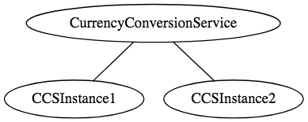
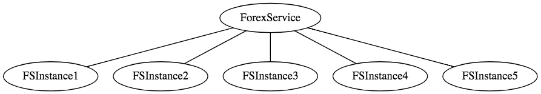
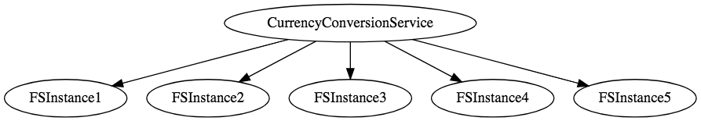
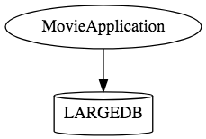
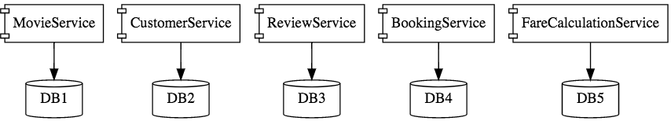
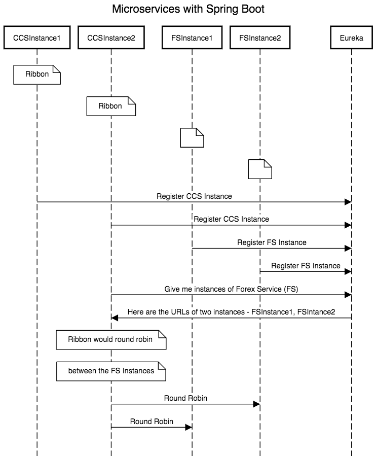

> 参考：
>
> https://dzone.com/articles/microservices-with-spring-boot-part-1-getting-star
>
>https://aws.amazon.com/microservices/

# Spring Boot的微服务 part1 入门

在本系列的第一部分中，我们将了解微服务的概念，并了解如何使用Spring Boot和Spring Cloud创建微服务。

本指南将帮助了解微服务和微服务架构的基础知识。我们还将开始研究使用Spring Boot的微服务的基本实现。

我们将创建一些微服务，并让他们使用Eureka命名服务器和功能区相互通信，以实现客户端负载平衡。

在本系列的第1部分中，我们将介绍微服务的概念，并了解如何使用Spring Boot和Spring Cloud创建出色的微服务。

## 你会学到什么

- 什么是传统应用
- 什么是microservice
- 微服务面临的挑战是什么？
- Spring Boot和Spring Cloud如何使开发微服务变得容易？
- 如何使用Ribbon实现客户端负载平衡。
- 如何实现命名服务器（Eureka命名服务器）。
- 如何将微服务与命名服务器和功能区连接。

## 微服务概述

在本系列文章中，我们将创建两个微服务：

- 外汇服务 - 缩写为FS
- 货币兑换服务 - 缩写为CCS

如果你感到有点疑惑，不要担心。在我们逐步创建微服务之前给出一个大图。

### 外汇服务

外汇服务（FS）是服务提供商。它提供各种货币的货币兑换价值。我们假设它与Forex Exchange交易并提供货币之间的当前转换价值。

示例请求和响应如下所示：

> GET to http://localhost:8000/currency-exchange/from/EUR/to/INR

以上请求是EUR兑换INR的货币兑换值。在响应中，conversionMultiple是75.稍后我们将讨论响应中的端口。

### 货币兑换服务

货币兑换服务（CCS）可以将一桶货币转换为另一种货币。它使用外汇服务获取当前货币兑换值。CCS是服务消费者。

示例请求和响应如下所示：

> GET to http://localhost:8100/currency-converter/from/EUR/to/INR/quantity/10000

```json
{
  id: 10002,
  from: "EUR",
  to: "INR",
  conversionMultiple: 75,
  port: 8000,
}
```

下图显示了CCS和FS之间的通信。


### Eureka命名服务器和功能区

根据负载，我们可以运行货币转换服务和外汇服务的多个实例。




每项服务的实例数可能会随时间而变化。下图显示了一个特定的实例，其中有五个外汇服务实例。



在上述情况下需要发生的是负载应该在这五个实例之间均匀分布。



## 什么是传统应用？

你曾经参与过一个项目吗？

- 每隔几个月发布一次（投入生产）？
- 哪个具有广泛的特性和功能？
- 哪个团队有超过50人参与其中？
- 哪里调试问题是一个很大的挑战？
- 何时引入新技术和新工艺？几乎是不可能的？

这些是整体应用的典型特征。传统应用程序通常很庞大 - 超过100,000行代码。在某些情况下甚至超过百万行代码。传统应用的特点是

- 应用程序大小
- 版本更新时间长
- 大团队

典型问题包括

- 可扩展性挑战
- 新技术的采用
- 新流程 - 敏捷？
- 难以执行自动化测试
- 难以适应现代发展实践
- 适应设备崩溃

## 什么是微服务？

微服务架构随着单片架构的发展，成为可扩展性和创新挑战的解决方案。

微服务的许多定义：

>Small autonomous services that work together. - Sam Newman

> Developing a single application as a suite of small services each running in its own process and communicating with lightweight mechanisms, often an HTTP resource API. These services are built around business capabilities and independently deployable by fully automated deployment machinery. There is a bare minimum of centralized management of these services, which may be written in different programming languages and use different data storage technologies. - James Lewis and Martin Fowler

## 微服务架构是什么样的？

先看看传统应用架构图：



这是使用微服务架构开发时相同应用程序的样子:



微服务架构涉及许多与消息交互的精心设计的小型组件。


## 微服务的优点

微服务的优点包括

- 新技术和流程适应变得更加容易。
- 更快的发布周期。
- 云扩展。

## 微服务架构面临的挑战

虽然开发一些较小的组件可能看起来很容易，但是存在许多与微服务架构相关的固有复杂性。让我们来看看一些挑战：

- 需要快速设置：不能花费太多的时间来设置每个微服务。
- 自动化：因为有许多较小的组件而不是整体组件，所以需要自动化所有内容 - 构建，部署，监控等。
- 可见性：现在可以部署和维护许多较小的组件，可能包含100个或1000个组件，应该能够自动监控和识别问题。需要对所有组件都有很好的可视性。
- 配置管理：需要维护跨环境的数百个组件的配置。所以需要一个配置管理解决方案
- 动态扩展和缩小：只有应用程序可以在云中轻松扩展和缩小，才能实现微服务的优势。
- “多米诺骨牌”效应：如果调用链底部的微服务失败，它可能会对所有其他微服务产生连锁效应。微服务应该是设计的容错。
- 调试：当存在需要调查的问题时，可能需要跨不同组件查看多个服务。集中日志和仪表板对于轻松调试问题至关重要。
- 一致性：无法使用各种工具来解决同样的问题。虽然促进创新很重要，但围绕用于实施/部署/监控微服务的语言，平台，技术和工具进行一些分散治理也很重要。

## 微服务架构挑战的解决方案

### Spring Boot

Spring Boot可以快速构建生产就绪的应用程序，并提供非功能性的功能：
- 嵌入式服务器（使用容器轻松部署）
- 指标（监控）
- 健康检查（监测）

### Spring Cloud

Spring Cloud为您的微服务提供云支持解决方案。它利用并构建在Netflix（Netflix OSS）开源的一些云解决方案之上。

#### 一些重要的Spring Cloud模块
- 动态扩展和缩小。使用组合
  - 命名服务器（Eureka）
  - 功能区（客户端负载平衡）
  - 假设（更容易的REST客户端）
- 可视性和监控
  - Zipkin分布式跟踪
  - Netflix API网关
- 使用Spring Cloud Config Server进行配置管理
- Hystrix的容错能力

在本系列文章中，我们将创建两个微服务：
- 外汇服务 - 缩写为FS
- 货币兑换服务 - 缩写为CCS

下图显示了CCS和FS之间的通信。我们将在这两个组件之间建立通信。

我们希望能够动态地扩展和缩小每个服务的实例数量。


每项服务的实例数可能会随时间而变化。下图显示了一个特定的实例，其中有5个外汇服务实例。


实现动态扩展和缩小的解决方案需要回答两个问题

- 货币转换服务（CCS）如何知道有多少外汇服务（FS）实例处于活动状态？
- 货币转换服务（CCS）如何在活动实例之间分配负载？

因为我们希望这是动态的，所以我们不能在CCS中硬编码FS的URL。这就是我们引入命名服务器的原因。

组件的所有实例（CCS和FS）都向Eureka命名服务器注册。当FS需要调用CCS时，它会向Eureka Naming Server询问活动实例。我们将使用Ribbon在FS的不同实例之间执行客户端负载平衡。

下面显示了当CCS向FS发出请求时会发生什么情况的高级序列图：



接下来的文章我们将进入：
- 创建FS - 我们将基于Spring Boot Starter Web和Spring Boot Started JPA创建一个简单的rest服务。我们将使用Hibernate作为JPA实现并连接到MySql数据库。
- 创建CCS - 货币转换服务 - 我们将创建一个简单的rest服务来调用FS
- 使用功能区进行负载平衡。
- 实施Eureka命名服务并通过Eureka连接FS和CCS。
