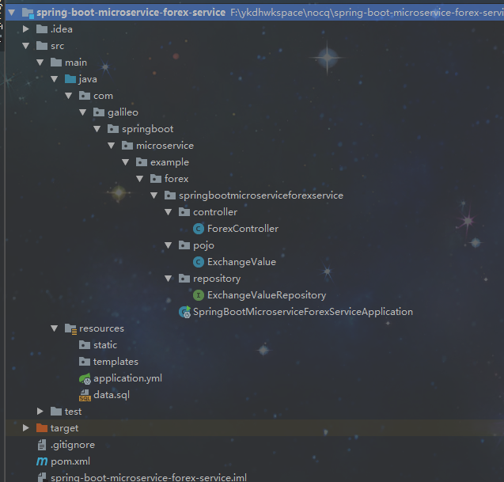
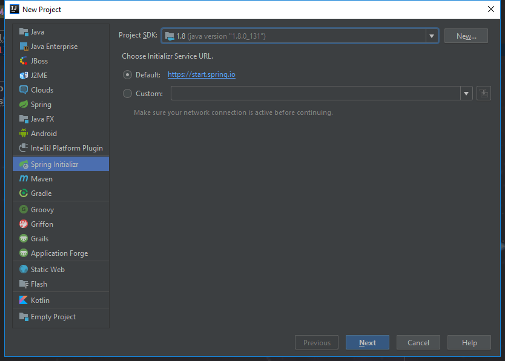
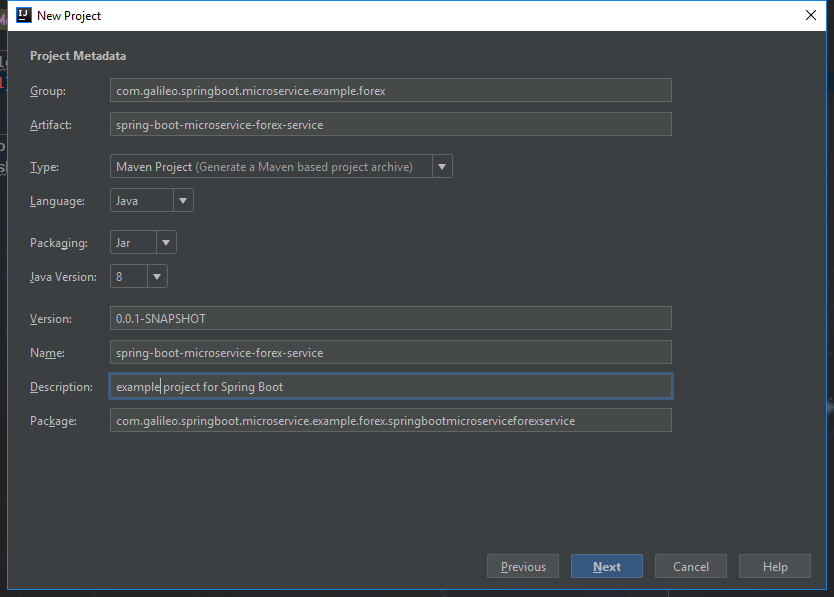
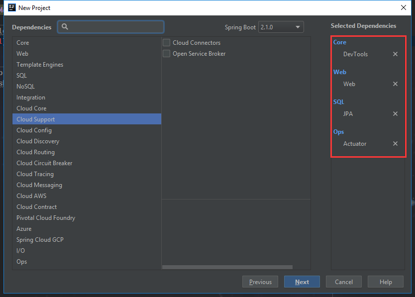

> 参考：
>
> https://dzone.com/articles/microservices-with-spring-boot-part-2-creating-a-f
>
>http://tengj.top/categories/Spring-Boot%E5%B9%B2%E8%B4%A7%E7%B3%BB%E5%88%97/

# Spring Boot的微服务 part2

让我们开始学习微服务和微服务架构的基础知识。我们还将开始研究使用Spring Boot的微服务的基本实现。我们将创建一些微服务，并使用Eureka命名服务器和功能区进行客户端负载平衡，让它们相互通信。

这是本系列的第2部分。在这一部分，我们将专注于创建Forex微服务。

我们将学习：

- 如何使用Spring Boot创建微服务。
- 如何创建JPA实体和资源。
- 如何让Spring MVC，Spring Boot，JPA，Hibernate和Mysql协同工作。

## 概述：

外汇服务（FS）是服务提供商。它提供各种货币的货币兑换价值。我们假设它与Forex Exchange交易并提供货币之间的当前转换价值。

示例请求和响应如下所示：

>GET to http://localhost:8000/currency-exchange/from/EUR/to/INR

```json
{
  id: 10002,
  from: "EUR",
  to: "INR",
  conversionMultiple: 75,
  port: 8000,
}
```

以上请求是EUR兑换INR的货币兑换值。在响应中，conversionMultiple为75。

## 项目代码结构

以下屏幕截图显示了我们将创建的项目的结构。



- SpringBootMicroserviceForexServiceApplication.java - 使用Spring Initializer生成的Spring Boot Application类。此类充当应用程序的启动点。

- pom.xml - 包含构建此项目所需的所有依赖项。我们将使用Spring Boot Starter Web和JPA。

- ExchangeValue.java - 实体

- ExchangeValueRepository.java - ExchangeValue JPA存储库。这是使用Spring Data JpaRepository创建的。

- ForexController.java - Spring Rest Controller暴露外汇转换服务。

- data.sql - exchange_value表的初始数据。从实体创建表后，Spring Boot将执行此脚本。

## 工具

- 构建工具 Maven 3.0+
- 一个称手的IDE，这里我们使用IDEA
- JDK1.8+

我的[GitHub存储库](https://github.com/GalileoFinchDudi/spring-boot-microservice-forex-service)包含完整的Maven项目以及所有代码示例。

## 使用Spring Initializr进行初始化

使用Spring Initializr创建一个微服务是一个很好的步骤。 [Spring Initializr](http://start.spring.io/)  是一个很好的工具来引导你的Spring Boot项目。您可以使用Spring Initializr创建各种项目。

这里我们直接使用IDEA内置Spring Initializr：





可以根据需要修改对应的group和Artifact。注意勾选图3中对应依赖。

## 创建ExchangeValue实体

注意这里我们为了代码的简洁使用了lombok插件，具体安装步骤可以参考该[文档](https://blog.csdn.net/zhglance/article/details/54931430)。

```java

package com.galileo.springboot.microservice.example.forex.pojo;

import lombok.AllArgsConstructor;
import lombok.Data;
import lombok.NoArgsConstructor;

import javax.persistence.Column;
import javax.persistence.Entity;
import javax.persistence.Id;
import java.math.BigDecimal;

@Entity
@Data
@AllArgsConstructor
@NoArgsConstructor
public class ExchangeValue {

    @Id
    private Long id;

    @Column(name="currency_from")
    private String from;

    @Column(name="currency_to")
    private String to;

    private BigDecimal conversionMultiple;

    private int port;

}
```

## 创建ExchangeValue实体对应JPA Repository

```java
import com.galileo.springboot.microservice.example.forex.pojo.ExchangeValue;
import org.springframework.data.jpa.repository.JpaRepository;

public interface ExchangeValueRepository extends
        JpaRepository<ExchangeValue, Long> {
    ExchangeValue findByFromAndTo(String from, String to);
}
```

### 笔记：

- public interface ExchangeValueRepository extends JpaRepository<ExchangeValue, Long> - 我们使用两个泛型扩展JpaRepository --ExchangeValue&Long。ExchangeValue是正在管理的实体，ExchangeValue的主键是Long。

- ExchangeValue findByFromAndTo(String from, String to); - 我们希望查询从一种货币到另一种货币的转换价值。

## 创建ForexController

```java
@RestController
public class ForexController {
  
  @Autowired
  private Environment environment;
  
  @Autowired
  private ExchangeValueRepository repository;
  
  @GetMapping("/currency-exchange/from/{from}/to/{to}")
  public ExchangeValue retrieveExchangeValue
    (@PathVariable String from, @PathVariable String to){
    ExchangeValue exchangeValue = 
        repository.findByFromAndTo(from, to);
    exchangeValue.setPort(
        Integer.parseInt(environment.getProperty("local.server.port")));
    return exchangeValue;
  }
}
```

### 笔记

- @RestController public class ForexController { - 创建一个Controller以公开Rest服务

- @Autowired private Environment environment - 我们想要返回服务器端口。这将有助于我们确定哪个实例服务正在提供响应。

- @Autowired private ExchangeValueRepository repository - 自动装配repository。

- ExchangeValue exchangeValue = repository.findByFromAndTo(from, to) - 从数据库中获取交换价值。

- exchangeValue.setPort(Integer.parseInt(environment.getProperty("local.server.port"))) - 从环境中获取端口并将其设置为响应bean。

## 配置应用程序名称和其他配置

```yml
spring:
  application:
    name: forex-service
  jpa:
    show-sql: true
  datasource:
    username: root
    password: root
    url: jdbc:mysql://localhost:3306/forex?useUnicode=true&characterEncoding=utf-8&serverTimezone=GMT
    driver-class-name: com.mysql.jdbc.Driver
server:
  port: 8000
```

我们为此应用程序分配了一个8000端口，并启用了相关调试日志记录，以及mysql数据连接。

## 将测试数据插入data.sql

让我们通过创建一个名为data.sql的文件来插入一些测试数据。Spring Boot Auto Configuration确保在应用程序启动时加载此数据。

```sql
DROP TABLE IF EXISTS `exchange_value`;
CREATE TABLE IF NOT EXISTS `exchange_value`(
   `id` BIGINT(20) NOT NULL AUTO_INCREMENT,
   `currency_from` VARCHAR(100),
   `currency_to` VARCHAR(40) ,
   `conversion_multiple` DECIMAL,
   `port` INT,
   PRIMARY KEY ( `id` )
)ENGINE=InnoDB DEFAULT CHARSET=utf8;

insert into exchange_value(id,currency_from,currency_to,conversion_multiple,port)
values(10001,'USD','INR',65,0);
insert into exchange_value(id,currency_from,currency_to,conversion_multiple,port)
values(10002,'EUR','INR',75,0);
insert into exchange_value(id,currency_from,currency_to,conversion_multiple,port)
values(10003,'AUD','INR',25,0);
```

## 测试Forex微服务

>GET to http://localhost:8000/currency-exchange/from/EUR/to/INR

```json
{
  id: 10002,
  from: "EUR",
  to: "INR",
  conversionMultiple: 75,
  port: 8000,
}
```

至此我们得到在表里对应的数据，已经json串返回值。
