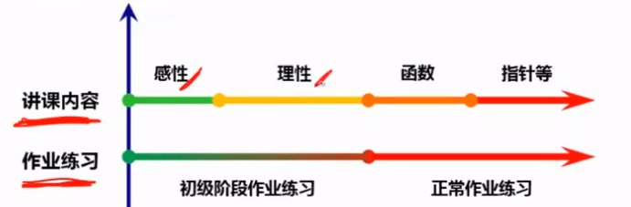

# 如何阅读技术文章？

阅读一本书，我们不应该一下就钻入书本。很多时候我总是习惯于一篇文章从看到结尾。虽然书是看完了，但是实际记住的信息寥寥无几。后来看`算法导论`和`C语言程序设计-现代方法`的时候，就更别提了，我甚至尝试过指读法和朗读法，逼迫自己待入文章。

一个月前，我停止了这种机械般的学习方法，先搜集整理了一部分学习方法总结，在这个网络信息时代，搜索到了太多信息，所以我选择了一些适合我的，记录下来。

## 阅读

也就是从感性认识到理性认识([`计算导论与C语言基础-北京大学`](https://www.bilibili.com/video/av10044439/?p=33))，**切记**感性认识并不是说让你不去深入技术细节，而是在你深入技术细节之前，点亮那一颗颗迷雾中的光。让你不至于迷失在技术细节里，而是有目标的去寻找答案。

当我们学习一项我们并不了解的新技术的时候。我们不要一下扎进每个api的实现，或者说不要想着一下就能理解作者的所有想法。首先要抽丝剥茧：

- 阅读文摘

- 阅读介绍

- 阅读结论

- 跳过所有的内容，寻找章节的标题、图标、数据等等。尝试找到整个文章的风格以及架构。
  
  - 这是一篇方法论、概念、理论、经验或者是一些其他文章？
  
  - 这是一篇调查文案、一种新颖的理论贡献、一种现有理论或技术的实验应用、一份批评还是其他文章？

- 接下来快速阅读整个事情，跳过一些方程式，一些数据和表格。

- 最后，回头仔细阅读整个内容，重点关注看起来最重要的那部分。

至此，我们已经对一篇文章有了大概的认知，对作者想表达的意思，写作风格以及文章内容有了大概的了解。

## 质疑

对于任何事情，我们都应该保留一点怀疑的态度。当你质疑一篇技术文章的时候，你就要试着指出他的问题，并不要觉得这是一种不礼貌的行为，在技术上的讨论，是一种双赢的局面。

- 询问这个论点是否有意义？他所据的案例是否够精彩？

- 将文章于相同领域的其他文章进行比较。（如果是第一次阅读这种类型的文章，可以尝试再找一些其他文章，并以上面的方式阅读以便。）比较他们的介绍和结论。

- 使用google学术搜索等资源搜索，找到一些引用了我们阅读的这篇文章的其他文章，看看他们是否有其他看法？是否有个blog相关地方引用其中概念？

- 查看参考文献，例如“经济文献杂志”，“手册”或“百科全书”文章或类似来源的调查文章，以了解本文如何适应其主题领域的更广泛背景。

## 坚持

坚持，很多时候都会提到的一点。学习是一件逆人性的事情，说白了，他不会让你感觉到很痛快。所以放弃也是很正常的事情。其次就是迷茫，很多知识都是枯燥的知识，什么是枯燥的知识？一般来说，枯燥的东西通常是你不感兴趣的东西，而你不感兴趣的东西，可能是你并不知道有什么用的东西。这样的知识通常是比较底层或是抽象度比较高的知识，比如：线性代数，或者一些操作系统内部的原理……越理论的东西就越让人觉得枯燥。

如果你发现有些知识太过于枯燥，那么可以通过下面的方法解决。

- 这个知识对于你来说来太高级了，你可能不知道能用在什么地方。

- 人的认知是从感性认识向理性认识转化的，所以，你可能要先去找一下应用场景，学点更实用的，再回来学理论。

- 学习需要有反馈，有成就感，带着相关问题去学习会更好。

## 犯错

这并不是说要故意的去犯错，而是犯错会让你学得到更多，通过错误总结教训，你会比没有犯过错的人体会得更深。但是千万不要犯低级错误，也不要同一个错误犯两次。

犯错之后要总结要思辨。当你积累的知识越多，在知识间进行联系和区辨的能力就越强，对知识进行总结和归纳也就越轻松。

无可否认，我们人总是会不自觉的美化自己。哪怕你是在自黑的时候。其次每个人的角度和层面都不一样。当你犯错的时候，你就会收到来自不同看法的建议，你会发现很多以前没有想到的知识盲区。

## 共享

你听别人讲，或是自己看书，或是让别人演示给你，这些都不能让你真正获得知识，因为你是在被别人灌输，在听别人说。

只有你开始自己思考，开始自己总结和归纳，开始找人交流讨论，开始践行，并开始对外输出，你才会掌握到真正的学习能力。

# 文献参考：

[how-to-read-an-academic-article](https://organizationsandmarkets.com/2010/08/31/how-to-read-an-academic-article/)

[左耳听风-高效学习篇](https://time.geekbang.org/column/48)

